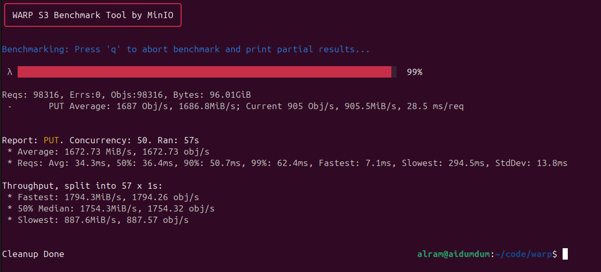
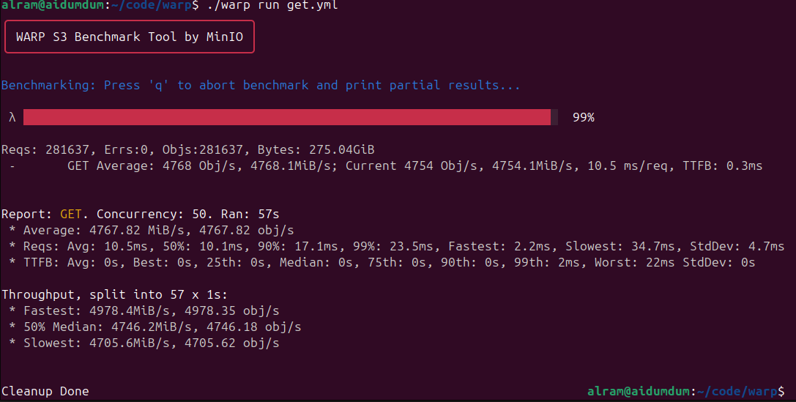
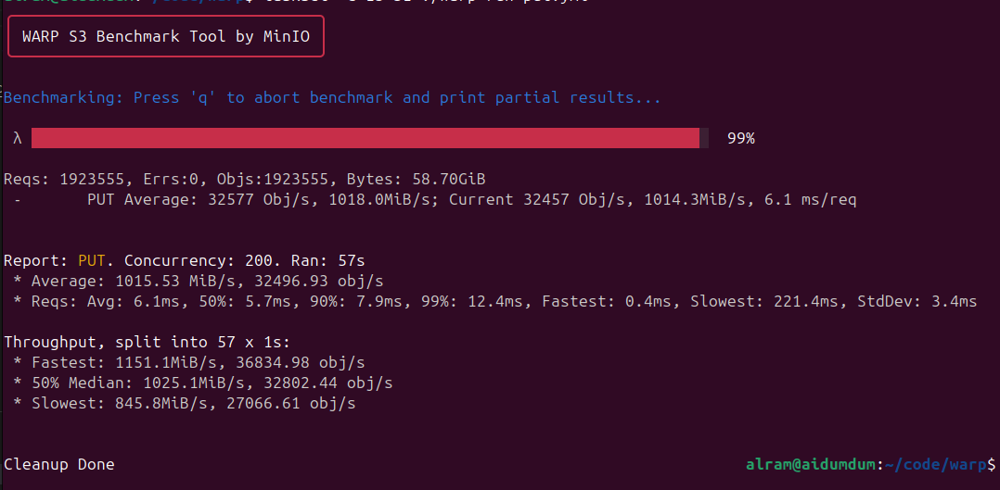
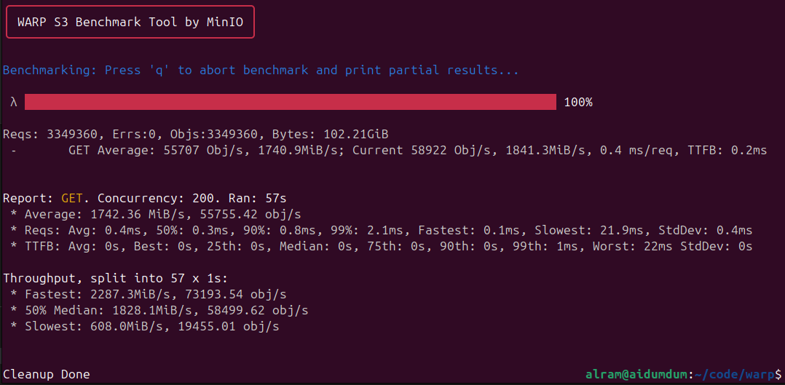

# LOBOS

**NOTE** This is a learning experiment to get familiar with C++ with no certain future maintenance or improvements.

Lobos (local objectstore) allows a user to transform any directory in their filesystem into an S3 bucket. Because the user themselves are enabling Lobos on their directory, we bind to `127.0.0.1` only and there's no S3 auth.

The parsing is pretty naive so things can get broken quick but the following seem to work with `aws s3` cli:
 - ListBuckets
 - HeadBucket
 - ListObjectsV2 (no max-keys, always recursive)
 - HeadObject
 - GetObject
 - PutObject
 - DeleteObject

 Benchmark tools `elbencho` and `warp` work as well.

## Reqs

You need boost 1.90 with the filesystem library compiled (`./b2 --with-filesystem`)

## Usage

```bash
$ ./lobos --help
Usage:
  lobos [options]

Options:
  -h, --help
      Show this help and exit
  -d, --dir
      Directory for lobos to transform into a S3 bucket
  -p, --port
      Port to the HTTP server should listen on (default 8080)
  -t, --threads
      Number of threads to use. Too many threads will have a
      detrimental impact on perf. (default: 8)
  -c, --pin-threads-to-cpus
      Pin threads to CPUs. Thread 0 will be pinned to CPU#0, etc. (Default: false)
  -e, --enable-lobos-index
      (In development) Enable Lobos index
  -r, --lobos-index-refresh-sec <sec>
      (Not implemented) Refresh interval in seconds
      This will re-sync the index while lobos is running to keep
      up with any changes made by other applications
```

By default, Lobos will use the local filesystem for operations such as `s3:ListObjects` to speed things up, Lobos implements a very simple in-memory index when using the `--enable-lobos-index` option. It is pretty inefficient and is in development. When using lobos' index, the `--lobos-index-refresh-sec` option (default 0: disabled) will be available to re-sync the index with any changes to the directory that were done outside of Lobos. The hope is that this will allow much faster ObjectList operations.

Launching Lobos:

```bash
$ LD_LIBRARY_PATH=~/code/lobos/src/boost_1_90_0/stage/lib  ./lobos --dir /home/alram/code/lobos -t 16 -c
====== OPTIONS ======== 
port=8080
lobos_dir=/mnt/bench/
lobos_index_enabled=0
lobos_index_refresh_sec=0
beast threads=16
thread pinning=1
======================= 
Starting S3 HTTP server for bucket lobos at 127.0.0.1:8080
```

Using the `aws` cli:

```bash
$ aws --endpoint-url http://127.0.0.1:8080 s3 ls
1969-12-31 16:00:00 lobos
$ aws --endpoint-url http://127.0.0.1:8080 s3 ls s3://lobos
                           PRE .vscode/
                           PRE src/
                           PRE testdir/
2026-01-02 18:04:05         30 .gitignore
2025-12-30 13:26:00        448 Makefile
2026-01-03 16:07:13    3010968 lobos
2026-01-03 15:46:37      30100 out
$ aws --endpoint-url http://127.0.0.1:8080 s3 ls s3://lobos/src/
                           PRE boost_1_90_0/
                           PRE index/
                           PRE s3http/
2025-12-10 08:10:21  170662122 boost_1_90_0.tar.bz2
2025-12-03 05:46:36        291 boost_1_90_0
2026-01-03 16:07:09       4525 lobos.cpp
2026-01-03 16:07:13     342480 lobos.o
```

Since there's no auth, you can also just use curl:

```bash
$ time aws --endpoint-url http://127.0.0.1:8080 s3 ls s3://lobos/src/ > /dev/null
real	0m0.602s
user	0m0.403s
sys	0m0.072s

$ time curl -s http://127.0.0.1:8080/lobos/src/ > /dev/null
real	0m0.123s
user	0m0.004s
sys	0m0.002s
```

## Performance

This was tested on a frame.work desktop (AMD RYZEN AI MAX+ 395) with 32GB of RAM for the CPU. For small objects (32KiB) it looks like `warp` was taking as much if not more resources than lobos so a more performant machine can probably do more RPS.

### PUT 1 MiB and 50 concurrent ops (~1672MiB/s)


### GET 1MiB and 50 concurrent ops (~4767MiB/s)


### PUT 32KiB and 200 concurrent ops (~32.5k RPS)


### GET 32KiB and 200 concurrent ops (~55.7k RPS)


## LMCache

I don't have an environment where I can easily test this but functionally it seems to work.

The configuration is similar to [CoreWeave's on LMCache official doc](https://docs.lmcache.ai/kv_cache/storage_backends/s3.html)

```bash
chunk_size: 256 # for func test I did 8 which but that way too low
local_cpu: False
save_unfull_chunk: False
enable_async_loading: True
remote_url: "s3://localhost:8080/bench"
remote_serde: "naive"
blocking_timeout_secs: 10
extra_config:
  s3_num_io_threads: 320
  s3_prefer_http2: False
  s3_region: "US-WEST-04A"
  s3_enable_s3express: False
  save_chunk_meta: False
  disable_tls: True
  aws_access_key_id: "not"
  aws_secret_access_key: "needed"
```

Saw hits:
```
(APIServer pid=37) INFO 01-07 20:17:18 [loggers.py:248] Engine 000: Avg prompt throughput: 4.6 tokens/s, Avg generation throughput: 2.6 tokens/s, Running: 1 reqs, Waiting: 0 reqs, GPU KV cache usage: 0.3%, Prefix cache hit rate: 39.8%, External prefix cache hit rate: 11.6%
(APIServer pid=37) INFO 01-07 20:17:28 [loggers.py:248] Engine 000: Avg prompt throughput: 0.0 tokens/s, Avg generation throughput: 7.3 tokens/s, Running: 1 reqs, Waiting: 0 reqs, GPU KV cache usage: 0.6%, Prefix cache hit rate: 39.8%, External prefix cache hit rate: 11.6%
```

And validated it hit lobos:

```bash
$ aws --endpoint-url http://127.0.0.1:8080 s3 ls s3://bench/ | head
2026-01-07 12:16:00     786432 vllm%40Qwen_Qwen3-Coder-30B-A3B-Instruct%401%400%406c9faa6ae5af1bdf%40bfloat16
2026-01-07 12:16:00     786432 vllm%40Qwen_Qwen3-Coder-30B-A3B-Instruct%401%400%40-7f89f621536990ce%40bfloat16
2026-01-07 12:16:00     786432 vllm%40Qwen_Qwen3-Coder-30B-A3B-Instruct%401%400%40-49ba81e7d7a6fad%40bfloat16
2026-01-07 12:16:00     786432 vllm%40Qwen_Qwen3-Coder-30B-A3B-Instruct%401%400%4047af06aebe49e1e6%40bfloat16
[...]
```